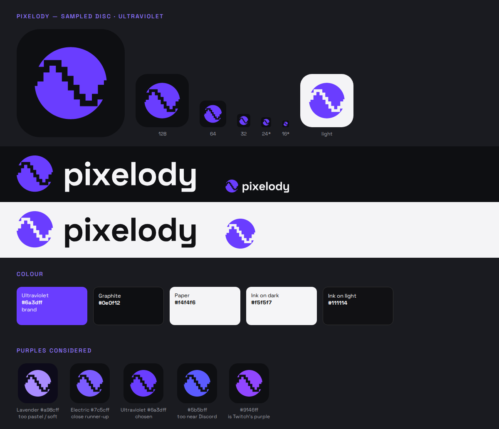

# Pixelody Mark

Status: **shipped.** The mark is Sampled Disc (A), the wordmark is W1, and the
brand colour is Ultraviolet. It is now the desktop build icon, the desktop
window/taskbar icon, the Android launcher icon (adaptive, with a themed-icon
layer) and the Android splash emblem. Users can recolour it within the purple
range described under "Logo colour setting" below.

## The idea: Sampled Disc

A disc, read as a record, split by one cycle of a sine wave drawn as
sample-and-hold steps. The disc is the melody, the steps are the pixels, and
the whole thing says "digital audio, sampled honestly", which matches
Pixelody's lossless, local-first stance.

The wave is **cut out** of the disc (real holes in the geometry, not a painted
stroke), so the mark works on any background without a matching fill.

## Construction (24-unit grid)

| Part | Geometry |
| --- | --- |
| Disc | circle centred `12,12`, r 8 |
| Wave | one sine cycle over x 4→20, sampled at 12 points (`sin(2π(i+½)/12)`), amplitude 4.5, heights snapped to 0.5 units, entering and leaving at y 12 |
| Cut | wave stroked 1.25 wide with square joins and subtracted from the disc; slivers under 2 square units are dropped |
| Small cut (16–24 px) | 8 samples, cut 1.7 wide, so the steps survive tiny sizes |
| App tile | 24 × 24, corner radius 5.25 |

The wave is point-symmetric about the disc centre, so the two halves of the
disc are identical rotated 180°.

The geometry is generated, not hand-drawn. Regenerate it rather than editing
the paths by hand if the numbers change.

## Colour

| Role | Value | Notes |
| --- | --- | --- |
| Brand (Ultraviolet) | `#6a3dff` | 3.4:1 on graphite, 5.1:1 on paper; both clear the 3:1 minimum for graphics |
| Graphite | `#0e0f12` | dark ground; neutral black, not purple-tinted |
| Paper | `#f4f4f6` | light ground |
| Ink on dark | `#f5f5f7` | wordmark |
| Ink on light | `#111114` | wordmark |

Why this purple: the aim is a colour with broad, even appeal, the way Spotify's
green doesn't skew toward any one audience. Pastel lavender (the round-3 draft)
reads soft and narrows the audience. A saturated, slightly blue-leaning violet
on neutral black/white reads as confident and techy instead. Two nearby purples
were ruled out because big platforms already own them: `#9146ff` is Twitch's
purple and `#5b5bff` sits next to Discord's blurple. `#7c5cff` (Electric Violet)
is the runner-up if Ultraviolet ever looks too dim on dark surfaces.

Only the mark carries colour. The wordmark stays neutral ink, and the purple is
never used as a gradient or paired with pink.

## Wordmark (W1)

"pixelody" in lowercase Space Grotesk Bold (wght 700, tracking −20/1000),
converted to outlines. In the lockup, the disc diameter is 1.56 × the cap
height, centred on the cap height, with a gap of 0.42 × the cap height. Space
Grotesk is OFL 1.1 and already bundled (see `THIRD_PARTY_ASSETS.md`); the OFL
permits using outlined glyphs in a logo.

## Logo colour setting

The mark's shape never changes; its colour can. Five colours make up the
purple range, with Ultraviolet as the default:

| Key | Name | Hex |
| --- | --- | --- |
| `ultraviolet` | Ultraviolet | `#6a3dff` |
| `electric` | Electric | `#7c5cff` |
| `indigo` | Indigo | `#5b5bff` |
| `grape` | Grape | `#8a3cf0` |
| `lavender` | Lavender | `#a98cff` |

- **Desktop:** Settings > Style > Logo color. This recolours the in-app mark
  (startup screen and the setting's preview) and switches the window/taskbar
  icon (the dock icon on macOS) to that colour's baked PNG. The installer and
  pinned shortcuts keep the Ultraviolet `build/icon.png`, because Windows reads
  those from the executable.
- **Android:** Profile > Logo color. This recolours the in-app mark and swaps the
  home-screen icon by enabling one of five launcher `activity-alias` entries.
- **Themes:** on base Pixelody (Studio) the mark always uses the chosen
  purple. Another active theme may recolour the in-app mark with its own accent
  unless the user turns off "Let other themes recolor the in-app logo". Desktop themes also recolour the running window/taskbar icon in memory
  using the generated mark. Installer, pinned shortcut and Android launcher
  icons keep their baked colours.

The list is defined in `src/brand-mark.js`, `tools/brand/logo-colors.json`
(written by the generator) and Android's `ui/brand/PixelodyLogoColor.kt`.
The development repository's checks fail if these, the Settings swatches, the
window icons, the launcher aliases or the Android colour resources disagree.

## Regenerating

Every logo file is written from one geometry by
`tools/brand/generate_brand_assets.py` (needs `shapely` and `fonttools`); then
`tools/brand/render_brand_pngs.js` rasterizes the PNGs using Playwright. To add
or change a colour, edit `LOGO_COLORS` in the generator, mirror it in
`src/brand-mark.js`, `PixelodyLogoColor.kt`, the Settings swatches in
`src/index.html` and the aliases in `AndroidManifest.xml`, then run both
scripts and `npm run check`. `scripts/create-release-icon.ps1` can rebuild
`build/icon.png` from `build/icon.svg` on Windows without Node.

## Files

| File | Use |
| --- | --- |
| `pixelody-app-icon.svg` / `-512.png` | Reference app icon (graphite tile) |
| `pixelody-app-icon-light.svg` | Paper tile |
| `pixelody-app-icon-small.svg` | 16–24 px favicon/tray; coarser 8-sample cut |
| `pixelody-mark.svg` | Tile-free mark in Ultraviolet |
| `pixelody-mark-mono.svg` | Tile-free mark in `currentColor` |
| `pixelody-wordmark.svg` | Wordmark alone, `currentColor` |
| `pixelody-lockup.svg` / `-light.svg` | Mark + wordmark for dark / light grounds (transparent) |
| `colors/` | App icon in each logo colour |

Shipped copies generated from the same geometry: `build/icon.svg`/`.png`,
`src/assets/brand/` (in-app mask and window icons), and in `android/app/src/main/res/`
`drawable/ic_launcher_foreground_*.xml`, `mipmap-anydpi-v26/ic_launcher_*.xml`,
`drawable/splash_brand_emblem.xml` and `values/brand_colors.xml`.

## Clear space and minimums

- Clear space: one quarter of the disc diameter on every side.
- Use the small icon at 24 px and below. The lockup needs a height of at least 20 px.
- Don't rotate the disc (the wave must rise first on the left), outline it,
  add gradients, or recolour the wave cut.
